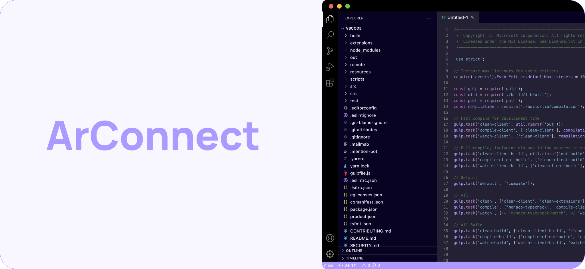

# Intro

<div data-full-width="false">

<figure><figcaption></figcaption></figure>

</div>

The ArConnect API is a JavaScript object, injected into each browser tab. To interact with it, you simply need to call one of the functions in the `window.arweaveWallet` object.

## Basic usage

To use ArConnect in your application, you don't need to integrate or learn how the ArConnect Injected API works. Using [`arweave-js`](https://npmjs.com/arweave), you can easily sign a transaction through ArConnect in the background:

```ts
// create Arweave transaction
const tx = await arweave.createTransaction({
  /* tx options */
});

// sign transaction
await arweave.transactions.sign(tx);

// TODO: handle signed transaction
```

When signing a transaction through [`arweave-js`](https://npmjs.com/arweave), you'll need to omit the second argument of the `sign()` function, or set it to `"use_wallet"`. This will let the package know to use the extension in the background to sign the transaction.

Once the transaction is signed, you can safely post it to the network.

## Advanced usage

The ArConnect Injected API provides extra functionalities in case you wish to utilize the user's wallet to its full extent securely. These features are not integrated in the `arweave-js` package, but can be useful to further customize your app. The above mentioned `window.arweaveWallet` object holds the api functions necessary for this.

Each function is described in detail in the following pages.


**Please remember:** to interact with the API, make sure that the `arweaveWalletLoaded` event has already been fired. Read more about that [here](events.md#arweavewalletloaded-event).


## TypeScript types

To support ArConnect types for `window.arweaveWallet`, you can install the npm package `arconnect`, like this:

```sh
npm i -D arconnect
```

or

```sh
yarn add -D arconnect
```

To add the types to your project, you should either include the package in your `tsconfig.json`, or add the following to your `env.d.ts` file:

```ts
/// <reference types="arconnect" />
```

## Additional Injected API fields

The ArConnect Injected API provides some additional information about the extension. You can retrive the wallet version (`window.arweaveWallet.walletVersion`) and you can even verify that the currently used wallet API indeed belongs to ArConnect using the wallet name (`window.arweaveWallet.walletName`).

```ts
addEventListener("arweaveWalletLoaded", () => {
  console.log(`You are using the ${window.arweaveWallet.walletName} wallet.`);
  console.log(`Wallet version is ${window.arweaveWallet.walletVersion}`);
});
```
