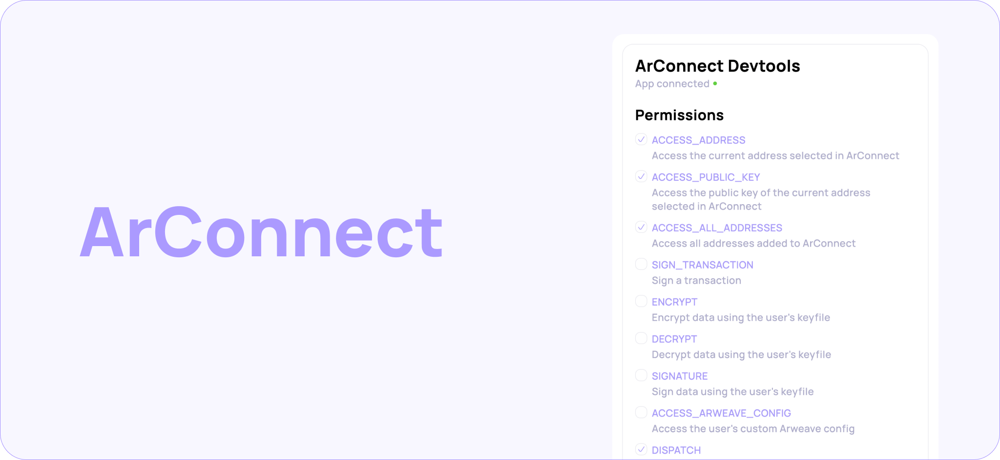

# 🦔 ArConnect Devtools

<figure><figcaption></figcaption></figure>

The ArConnect devtools allows you to easily connect your application to the extension and manage its settings.


**Note:** ArConnect Devtools is only available in the [**ArConnect BETA**](beta.md).


## Connect

Upon startup, you'll be able to connect your app. You can select what permissions you want to allow the app to have. Once you selected the permissions you want, click _Force Connect_.

## Manage your app

The following settings are available at a glance for your app:

* Permissions \
  Manage permissions for your application quickly.
* Allowance \
  Manage spending allowance for your app
* Gateway \
  Select from suggested gateways or enter a custom one
* Bundlr node \
  Set the Bundlr node your app uses when calling [`dispatch()`](../api/dispatch.md)
