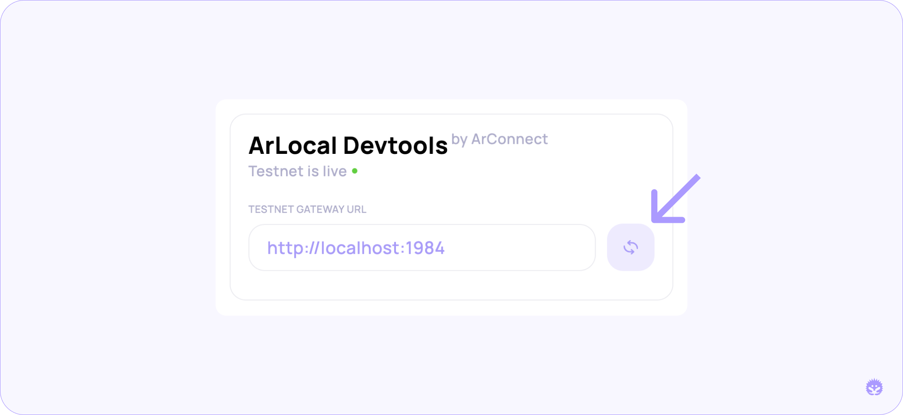

# 📍 ArLocal Devtools

<figure><figcaption></figcaption></figure>

The new [`ArLocal`](https://github.com/textury/arlocal) Devtools allow developers to easily interact with their local or public testnet without having to run scripts to perform certain actions. The tool can be accessed by opening the browser's devtools and clicking on the `ArLocal` tab.


**Note:** ArLocal Devtools is only available in the [**ArConnect BETA**](beta.md).


## Setup

Upon startup, the tool will ask you to provide some information about the arlocal gateway you want to use. After setting the gateway URL, click the refresh button to load the action sheet.

<figure><figcaption></figcaption></figure>

## Mint testnet AR

You can mint testnet Arweave tokens that can be used like regular AR. Enter the desired amount in the input under the `Mint AR` title and click *Mint*. The tool will call the testnet to deposit AR into the currently active wallet in ArConnect and request the testnet to mine a block.

## Create testnet transaction

The ArLocal Devtools allow you to create new transactions with tags, a target and data. Simply set the desired fields under the `Create Transaction` title, enter your password and click *Send Transaction*. The tool will submit the transaction and request the testnet to mine a block.

## Manual block mine

You can manually request the testnet to mine a block by clicking the *Mine* button, under the *Send Transaction* button.
